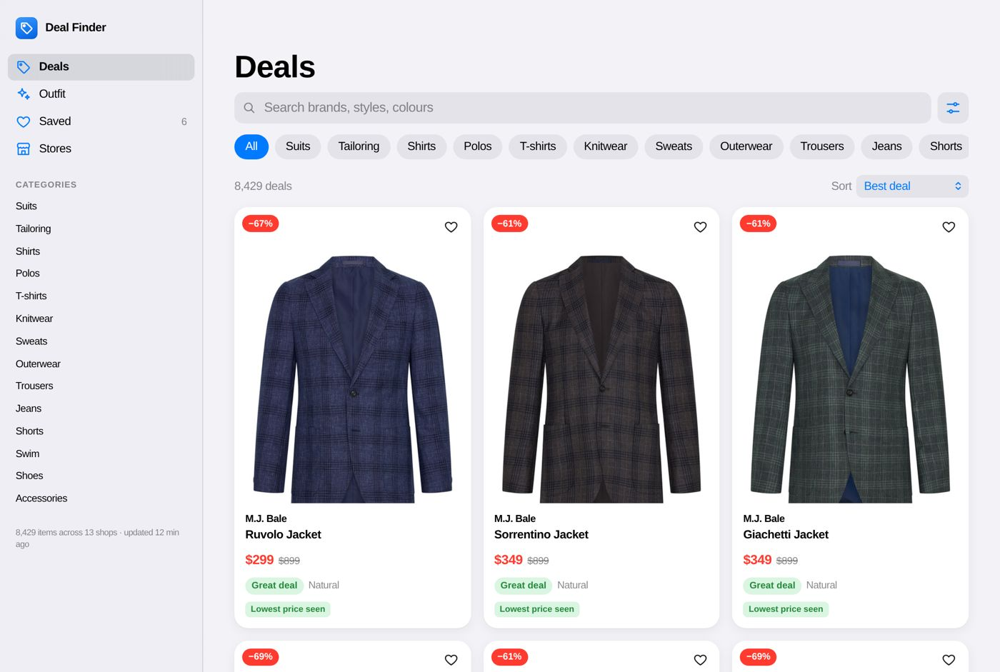
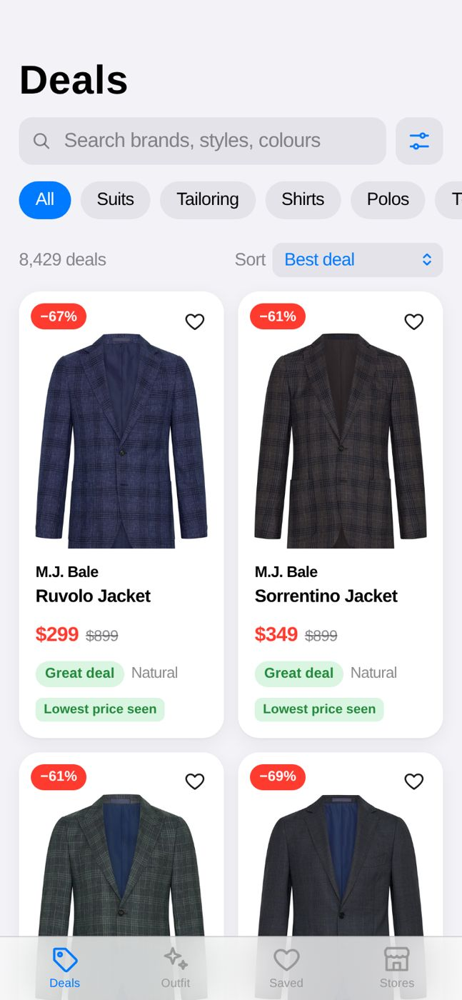
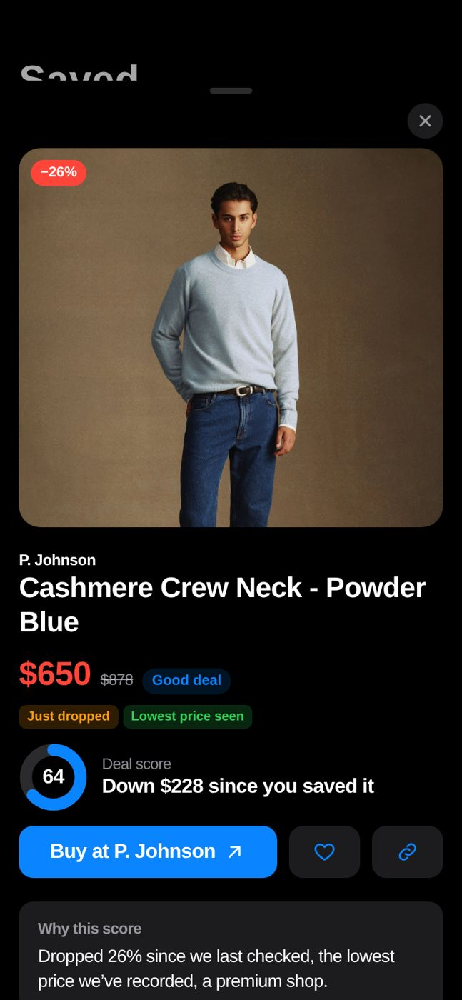
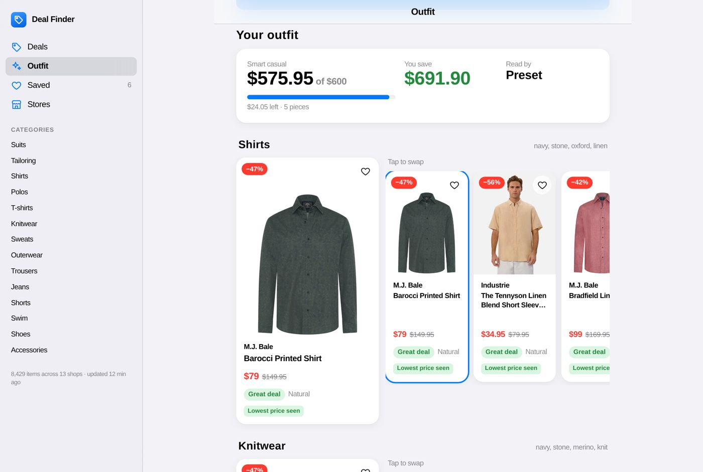

# Deal Finder

Find genuine markdowns on mid-to-premium menswear from Australian shops.

Deal Finder reads the full public catalogues of 13 shops for free, keeps every
price it sees, and ranks what is actually a good buy. There are no AI agents
and no search costs unless you turn them on.



<p>


</p>

## Shops

| Free: full catalogue, every price change | Tier |
|---|---|
| M.J. Bale, P. Johnson, Harrolds, Aquila, Venroy, Bassike, Calibre | Premium |
| Peter Jackson, Industrie, Academy Brand, Jac+Jack, Oxford, Gazman | Mid |

These shops run on Shopify, which publishes each catalogue with sale and full
prices. Deal Finder keeps only menswear, and skips gift cards, socks,
underwear, eyewear and shoe care.

THE ICONIC and David Jones have no such feed, so Deal Finder reads their men's
sale listings instead (`src/deal_finder/scrape.py`): every shoe on sale at
both, plus the first pages of their clothing sales (about 2,600 items from
THE ICONIC and 1,500 from David Jones, a couple of minutes each). Listings show
no fabric, and David Jones shows only some sizes, so those items count as
"size not stated". A shop redesign can break this; the Stores page then shows
that shop in red.

Country Road blocks catalogue reads. You can search it on request through Serper (optional, about A$0.002 a search, capped per
day, cached for a day). Only the current price is known for those, so they
appear beside the scored deals rather than among them.

To add a Shopify shop, add one line to `src/deal_finder/stores.py`.

## What counts as a good deal

Each item gets a score out of 100:

| Part | Points |
|---|---|
| Markdown: the shop's "was" discount, or a drop we saw ourselves in the last 14 days; full marks at 60% off | 45 |
| Dollars saved; full marks at $200 | 10 |
| Lowest price we have recorded (after 3 days of tracking) | 15 |
| Fabric: natural 15, natural with a little stretch 9, unknown 5, synthetic 0 | 15 |
| Shop tier: premium 15, mid 8 | 15 |

Gazman and Oxford mark most of their range down all the time, so their "was"
discounts count at half and carry a **Store-wide sale** badge. You can hide
them in Filters. **Just dropped** means the price fell since an earlier check.

## Run it

You need Python 3.10–3.13 and [uv](https://docs.astral.sh/uv/).

```bash
uv sync
uv run deal_finder
```

Open <http://127.0.0.1:8000>. The first start downloads every catalogue,
which takes about two minutes. After that, shops refresh every 12 hours while
the app runs, and **Stores → Update Now** refreshes them on demand.

Keys are optional. Copy `.env.example` to `.env` to add them:

* `ANTHROPIC_API_KEY` lets the Outfit page read free-text briefs with Claude.
  That is one small call per new brief, and repeating a brief is free. Without
  a key, looks like "office" or "summer wedding" use built-in presets, and
  lists like "navy blazer, white shirt, brown loafers" are read word by word.
* `SERPER_API_KEY` turns on searching Country Road.

## Host it on Vercel

The repo deploys to Vercel as-is (`app.py` is the entrypoint; `vercel.json`
sets the Sydney region, a 5-minute limit and a daily refresh). All of it fits
Vercel's free Hobby plan and Neon's free Postgres plan.

1. **Import the repo.** In Vercel choose **Add New → Project**, pick
   `deal-finder-crew` and deploy. Or use
   [this link](https://vercel.com/new/clone?repository-url=https%3A%2F%2Fgithub.com%2Fzed6991%2Fdeal-finder-crew&env=APP_PASSWORD,CRON_SECRET&envDescription=APP_PASSWORD%20is%20your%20sign-in%20password.%20CRON_SECRET%20is%20any%20long%20random%20string.).
2. **Add a database.** In the project open **Storage → Create Database → Neon**
   (Postgres, free) and pick the Sydney region. Vercel adds `DATABASE_URL` for you.
3. **Set two environment variables** under **Settings → Environment Variables**:
   * `APP_PASSWORD`: the password for signing in. The hosted app is on the open
     internet, so it will not start without one.
   * `CRON_SECRET`: any random string of 16+ characters. Vercel sends it with
     the daily refresh so nobody else can trigger it.
   * Optional: `ANTHROPIC_API_KEY`, `SERPER_API_KEY`, as for running locally.
4. **Redeploy** (Deployments → ⋯ → Redeploy) so the variables take effect.

Open the site and sign in. The first visit downloads every catalogue, shop by
shop, which takes about two minutes; you can browse as each shop arrives.

How it stays fresh: on the Hobby plan Vercel runs the refresh job once a day
(between 3 and 4 am Sydney time). Opening the app also refreshes any shop more
than 12 hours old. **Stores → Update Now** refreshes everything on demand.

To try hosted mode locally: `VERCEL=1 APP_PASSWORD=… DATABASE_URL=postgresql://… uv run uvicorn app:app`.

## The app

* **Deals**: search, category chips, and filters for discount, price, your
  sizes, fabric, premium shops, or particular shops. Sort by best deal,
  discount, price or newest. Tap an item to see its price history, sizes in
  stock (yours highlighted) and why it scored as it did.
* **Outfit**: describe a look and a budget. You get the best-value piece for
  each part, within budget and in your sizes, with alternatives to tap and swap.
* **Saved**: tap the heart to watch a price. Saved items show how much they
  have moved since you saved them.
* **Stores**: your sizes, each shop's status, and paid-search usage.

The design follows Apple's Human Interface Guidelines: system font, iOS
colours with automatic dark mode, grouped lists, segmented controls, switches
and sheets. It uses a sidebar on wide screens and a tab bar on phones.



## Command line

```bash
uv run deal_finder sync                          # refresh every shop (free)
uv run deal_finder sync mjbale peterjackson      # just these
uv run deal_finder deals linen --category Shirts --min-discount 40
uv run deal_finder deals --premium --max-price 300
uv run deal_finder outfit "smart casual dinner, navy and stone" 600
uv run deal_finder outfit "something for a garden party" 500 --ai
```

## How it fits together

```
src/deal_finder/
├── stores.py      the shops, their tier, and how to tell menswear apart
├── sync.py        downloads catalogues politely (paged, retried, throttled)
├── normalize.py   raw product → category, fabric, colour, sizes, price, was price
├── db.py          SQLite or Postgres: products, price history, saved items, settings
├── auth.py        the hosted app's password and the cron secret
├── deals.py       deal score, search and filters, shop mixing
├── stylist.py     brief → shopping list (presets, keywords, or Claude) → outfit
├── extra.py       optional paid search for shops that block catalogue reads
├── main.py        command line
└── web/           FastAPI app and the front end (plain HTML, CSS and JS)
```

Data lives in `data/deals.db` locally, or in Postgres when `DATABASE_URL` is
set (as on Vercel). Delete the file to start afresh.

## Tests

```bash
uv run pytest
TEST_DATABASE_URL=postgresql://localhost/test uv run pytest   # also run every database test on Postgres
```

The tests cover categories, fabric rules, menswear filtering, price tracking,
scoring, sizes, search, outfits, the Claude call (with a fake client), paid
search limits, sign-in, the cron job and the API. None of them use the network.
