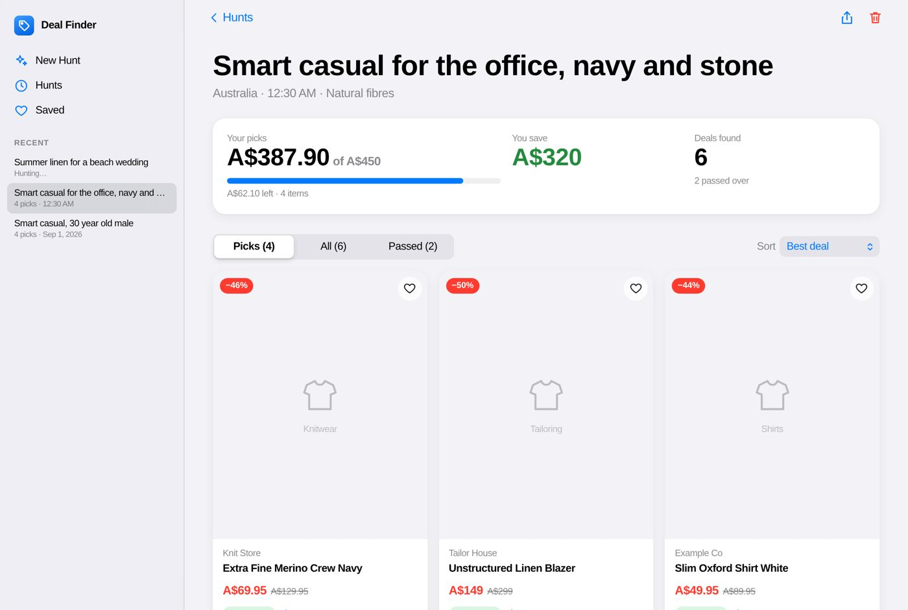
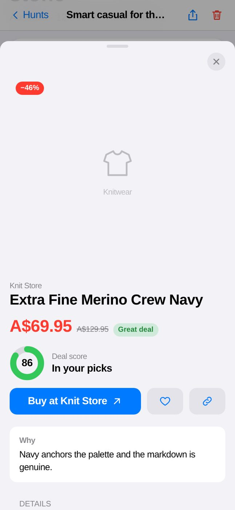

# Deal Finder

Find good deals on menswear. Describe a look, set a budget, and a crew of AI
agents plans the outfit, hunts for sale prices, checks each price on the
retailer's own page, and hands back the best buys that fit your budget.





*Screenshots use made-up products to show the layout.*

## How it works

| Step | Who | What |
|---|---|---|
| 1. Plan | Stylist agent | Turns your brief into 4–8 garments, with fabric, colour, fit and search queries. |
| 2. Hunt | Deal hunter agent | Searches Google Shopping (via Serper) for each garment, favouring markdowns. |
| 3. Check | Price checker agent | Opens each product page and reads the price, the "was" price, fabric and stock. |
| 4. Judge | Curator agent | Scores how well each product suits the brief, with a one-line reason. |
| 5. Pick | Plain Python | Works out discounts, applies your fabric and discount rules, scores every deal, and picks one item per garment within budget. |

Step 5 is ordinary code, not a model, so the sums are always right. It also
drops any link that no search or page tool actually returned, so the agents
cannot slip in made-up products.

### Deal score (0–100)

* Discount: up to 45 points (maxes out at 60% off)
* Style fit, judged by the curator: up to 35
* Price checked on the product page: 10
* Fabric: 10 natural, 6 stretch blend, 3 unknown

75 and up is a **Great deal**, 55 and up a **Good deal**.

## Set up

You need Python 3.10–3.13 and [uv](https://docs.astral.sh/uv/).

```bash
uv sync
cp .env.example .env    # then add your keys
```

Keys:

* `SERPER_API_KEY`: search results, from [serper.dev](https://serper.dev) (free tier available).
* A model key, such as `OPENAI_API_KEY`. Set `MODEL` to choose the model; any
  CrewAI model string works (`openai/gpt-4o-mini`, `anthropic/claude-sonnet-5`, `ollama/llama3.1`…).

## Use the app

```bash
uv run deal_finder serve
```

Then open <http://127.0.0.1:8000>.

* **New Hunt**: write a brief, or tap an idea. Set budget, region, sizes,
  fabric rule (natural only, stretch OK, any), minimum discount and categories.
* **Live progress**: see each stage, searches run and pages checked.
* **Results**: your picks against the budget, total saved, and three tabs.
  *Picks* is the outfit within budget, *All* is every deal that passed your
  rules, and *Passed* shows what was ruled out and why. Sort by best deal,
  discount, saving or price. Tap a card for details, then buy, save or copy the link.
* **Saved**: tap the heart on any deal. Saved deals stay in your browser.
* **Export**: download any hunt as a Markdown buyer's guide.

Without keys, the app still opens and offers a sample hunt from an earlier real run.

The design follows Apple's Human Interface Guidelines. It uses the system
font, iOS system colours with automatic dark mode, grouped inset forms,
segmented controls, a translucent sidebar on desktop and a tab bar on phones,
and product details in a sheet.

## Use the command line

```bash
uv run deal_finder hunt "summer linen for a beach wedding" 600 \
    --region au --sizes "M, 32 waist" --fabric stretch --min-discount 20 \
    --categories Shirts Trousers
```

`crewai run` runs a hunt with the defaults in `src/deal_finder/main.py`.
Every hunt writes `output/deals.md`, and saves its full record to `output/hunts/<id>.json`.

Regions: `au`, `us`, `gb`, `ca`, `nz`.

## Project layout

```
src/deal_finder/
├── config/agents.yaml      # the four agents
├── config/tasks.yaml       # plan → hunt → verify → assess
├── crew.py                 # wires agents, tools and typed task outputs
├── models.py               # request, task outputs, deals, report
├── scoring.py              # discounts, fabric rules, scores, budget picks, Markdown
├── progress.py             # live progress shared by tools and the web app
├── service.py              # runs a hunt and stores it
├── tools/search.py         # Serper shopping and web search
├── tools/product_page.py   # reads price facts from product pages
├── web/app.py              # FastAPI server
└── web/static/             # the front end (plain HTML, CSS, JS)
```

## Tests

```bash
uv run pytest
```

The tests cover scoring, fabric rules, page parsing, the API and the sample
hunt. None of them call a model or the network.
